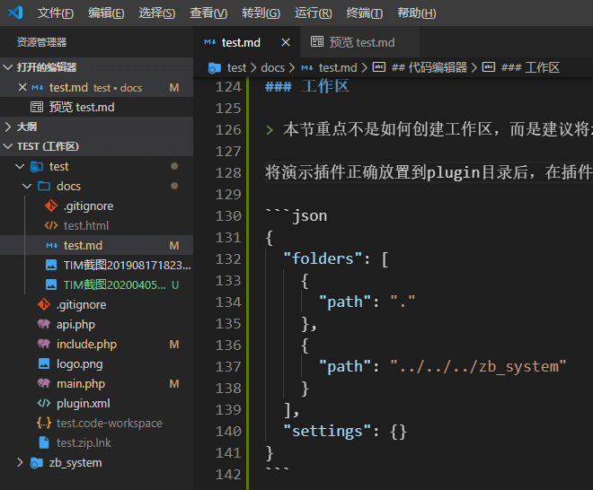
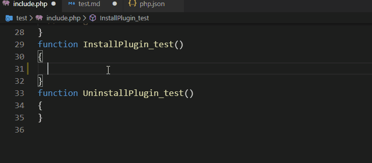
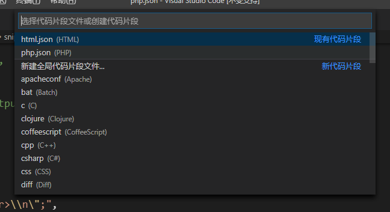

## 相关推荐

> 教程贴索引[电梯]-Z-BlogPHP-ZBlogger 技术交流中心
> https://bbs.zblogcn.com/thread-94927.html
>
> 初学者 Teaching 计划-开发者中心-ZBlogger 技术交流中心
> https://bbs.zblogcn.com/thread-102975.html
>
> 【开发者】大概算是进阶建议贴-开发者中心-ZBlogger 技术交流中心
> https://bbs.zblogcn.com/thread-101310.html
>
> 开发者准入规范讨论贴-论坛事务-ZBlogger 技术交流中心
> https://bbs.zblogcn.com/thread-103787.html
>
> ---------
>
> 为什么当代社会中有很多人认为视频阅读替代文字阅读是一件可怕的事？：
> [https://www.zhihu.com/question/357332826/answer/1845022977](https://www.zhihu.com/question/357332826/answer/1845022977 "为什么当代社会中有很多人认为视频阅读替代文字阅读是一件可怕的事？ - 知乎")
>
> ---------
>
> Z-BlogPHP 官方文档：
>[https://docs.zblogcn.com/php/#/](https://docs.zblogcn.com/php/#/ "Z-BlogPHP 官方文档")

## 前言

对于已经不需要教程的我来说，并不能很客观地评断他人的教程是否对初学者有价值，自己写的这份也一样，，自己会和教会他人是两回事。。。

注：常规意义上，，汽车的生产、售卖方并不需要为你考不来驾照负责，所以 PHP 本身，以及最基本的前端知识还是需要自己具备，「 w3school 在线教程 https://www.w3school.com.cn/index.html 」

**重要：另外并不是严谨的官方文档所以会写得比较电波。。**

## 开始

开发主题或插件需要`分别`开启`应用中心插件`和`Z-Blog`的「开发模式」[点击这个链接查看](do/ "点击查看")

## 关于接口

其实能够理解「接口」算是比较重要的界限，官方文档这部分姑且也是我写的：[接口列表](https://docs.zblogcn.com/php/#/books/dev-interfaces "接口列表")；

「严格来说，全部接口都是「监听」，监听接口本身被触发，然后执行指定的操作，或者对接口传递的数据进行处理。」

按下边火车的比喻就是：

- 当车经过某一站时……执行某项操作……
  - 比如给某节车箱内全员发顶帽子……
- 当车经过某一站时，并且检查下车上有没有人穿红衣服，如果有……
  - 给符合条件的人发顶帽子……
  - 或者红衣服仅为判断，帽子发给没有穿红衣服的……

## 基于 include.php 的标准用法

可以类比一列火车。。出发时会从数据库带上固定的货物，，可以在途经的站点向指定的车箱内增加东西。。或者干脆加挂车箱。再或者把车上的东西搬下来加工一下再搬回来。

所有预定的操作都需要在出发前申请。。

```php
// 申请人“HelloZBlog”，具体申请事项见ActivePlugin_HelloZBlog函数
RegisterPlugin("HelloZBlog","ActivePlugin_HelloZBlog");

function ActivePlugin_HelloZBlog() {
  // 在名为Filter_Plugin_Index_Begin的站点停靠，停靠后干啥见HelloZBlog_hello
  Add_Filter_Plugin('Filter_Plugin_Index_Begin', 'HelloZBlog_hello');
}

function HelloZBlog_hello()
{
  // 在第一节车箱放一箱橘子【雾
  global $zbp;
  $zbp->header .= '<script>alert("hello")</script>';
}
```

预约制和买票上车制的不同是，前者到站后你要等叫号，叫到你你再上。

列车发车后，「车长」手里会有这样一份表格，而前边的 Add_Filter_Plugin()函数就相当于填写这张表；

| 站点名                    | 事项列表              |
| ------------------------- | --------------------- |
| aaa                       | eeee,ttew,aewe        |
| Filter_Plugin_Index_Begin | HelloZBlog_hello,XXXX |
| nnn                       |                       |

```php
// 到达名为Filter_Plugin_Index_Begin的站点后，对应表格按顺序执行相应的事项
foreach ($GLOBALS['hooks']['Filter_Plugin_Index_Begin'] as $fpname => &$fpsignal) {
    $fpname();
}
```

## 插件自己新开一条铁路

插件下新建一个 api.php 文件然后写入如下示例

```php
<?php
// 引入必要的系统文件
require '../../../zb_system/function/c_system_base.php';
// 初始化
$zbp->Load();
// 判断当前所属性插件是否启用
if (!$zbp->CheckPlugin('HelloZBlog')) {
  $zbp->ShowError(48);
  die();
}
// 根据功能可能需要鉴权，本示例为任何人知道地址就能访问并查看本页的运行结果
// http://127.0.0.1/zb_users/plugin/HelloZBlog/api.php

// 取最新10篇文章
$articles = GetList(10);
$pagebar = new Pagebar($zbp->option['ZC_INDEX_REGEX'], true, true);
// 要应用主题模板必须指定pagebar标签，省略了很多属性值，所以结果会是第0页
$zbp->template->SetTags('articles', $articles);
$zbp->template->SetTags('pagebar', $pagebar);
$zbp->template->SetTemplate('index');
$zbp->template->Display();
// die();
```

## 配置项功能

很多时候，插件需要用户输入或选取一些内容并保存，然后插件运行时取用

以下是一个由用户决定读取多少篇文章的示例。

```php
// 用于获取用户输入的表单写在main.php里，请下载附件，附件代码侧重点会不一样，也更接近实用
// 保存，视情况需要对用户输入的内容进行判断和转换，比如这里实际应该确保用户提交的是正整数
if (GetVars('act', 'GET') == 'save') {
  $zbp->Config('HelloZBlog')->num = GetVars('num', 'POST');
  $zbp->SaveConfig('HelloZBlog');
}
// 使用
$num =  (int)$zbp->Config('HelloZBlog')->num;
$articles = GetList($num);
// 模板内使用
{$zbp.Config('HelloZBlog').text}
```

## 附件下载

wdssmq/HelloZBlog: zblog 插件开发演示

https://github.com/wdssmq/HelloZBlog

---

zblog 插件开发演示 - Z-Blog 应用中心

https://app.zblogcn.com/?id=18072

---

其他资源下载：

首先请加入 QQ 群【我的咸鱼心】：https://jq.qq.com/?_wv=1027&k=57d1Eii

你可以在群共享中下载到 Resilio Sync 这个软件。具体怎么用你需要自行学习 →[戳这里](https://www.zhihu.com/topic/20064280/hot "Resilio Sync")

然后复制如下 Key 或链接进去：

**BMNFE2WCBU5Y3TMRMDU6PFEQYI6IC5IFW**

`#唯有脑洞与套路`中会时不时扔一些收费插件，想白嫖的建议重点关注

## 代码编辑器

Visual Studio Code - Code Editing. Redefined
https://code.visualstudio.com/

Chinese (Simplified) Language Pack for Visual Studio Code - Visual Studio Marketplace
https://marketplace.visualstudio.com/items?itemName=MS-CEINTL.vscode-language-pack-zh-hans

### 工作区

> 本节重点不是如何创建工作区，而是建议将 zb_system 文件夹纳入到每个插件的工作区以方便开发。

将演示插件正确放置到 plugin 目录后，在插件文件夹内有一个 HelloZBlog.code-workspace 文件，内容如下：

```json
{
  "folders": [
    {
      "path": "."
    },
    {
      "path": "../../../zb_system"
    }
  ],
  "settings": {
    "intelephense.environment.includePaths": [
      "../../../zb_system"
    ]
  }
}
```

**一个很重要的快捷键：`ctrl + shift + f`**

注：`intelephense.environment.includePaths`的说明见这篇：[【VSCode 笔记】PHP 跨文件夹函数定义提示_电脑网络_沉冰浮水](https://www.wdssmq.com/post/20200930532.html "【VSCode笔记】PHP跨文件夹函数定义提示_电脑网络_沉冰浮水")

(↓↓进阶用法中可直接生成该文件来方便开发↓↓)

开发者工具 Z-Blog 应用中心 `https://app.zblogcn.com/?id=1254`

默认 vscode 打开效果如图



### 推荐插件

[【列表】VSCode 插件推荐_电脑网络_沉冰浮水](https://www.wdssmq.com/post/20201120794.html "【列表】VSCode插件推荐_电脑网络_沉冰浮水")

### 快捷键

[【VSCode】快捷键备忘_电脑网络_沉冰浮水](https://www.wdssmq.com/post/20130525410.html "【VSCode】快捷键备忘_电脑网络_沉冰浮水")

### 代码片段

**带有「代码片段」的注释表明其下的代码可以使用快捷生成**

↓↓【使用效果】↓↓



----

**添加代码片段到 VSCode**

【查看】→【命令面板】（快捷键 ctrl+shift+p）

↓↓【输入`代码片段`】↓↓


↓↓【找到`PHP`或者`html`】↓↓



【在打开的文件中编辑添加】

【也可以直接从下边项目中复制】

[https://github.com/wdssmq/snippets/tree/master/vscode/zblogcn](https://github.com/wdssmq/snippets/tree/master/vscode/zblogcn "zblog代码片段")

-----

**要点**

右边缩略词可以输出同一份代码片段：`["log", "v_log", "var_dump", "print"]`

会输出如下内容：

```php
// 前后的debug是分隔，调试完成后可以整体注释掉或者删除
// debug
// ob_clean(); // 偶尔有一些情况需要清空前边输出的内容，取消这一行的注释就行
echo __FILE__ . "丨" . __LINE__ . ":<br>\n";
var_dump(''); // 光标默认定位在括号里，并处于选中状态，可以直接键入自己要输出的东西
echo "<br><br>\n\n";
// die(); // 按tab键会跳到这一行并选中，可以在需要的时候按快捷键取消注释
// debug

// 使用示意
if (1 == 2) {

  // debug
  // ob_clean();
  echo __FILE__ . "丨" . __LINE__ . ":<br>\n";
  var_dump('因为1不等于2所以这里并不会输出，在实际代码中就可以确定问题是出在条件语句或更之前的地方');
  echo "<br><br>\n\n";
  // die();
  // debug

  // 预期要执行的东西
}
```

## 其他

### RSS

RSS - 知乎
https://www.zhihu.com/topic/19551894/top-answers

使用 feeds.pub 订阅我的博客
https://feeds.pub/feed/https%3A%2F%2Ffeed.wdssmq.com

Z-Blog 相关资讯 RSS 订阅-博友杂谈-ZBlogger 技术交流中心
https://bbs.zblogcn.com/thread-100631.html

### Resilio_Sync

Resilio Sync - 知乎
https://www.zhihu.com/topic/20064280/hot

### Markdown

本文档是用 MD 语法写就，感兴趣也可以试下，VSCode 直接有相应插件，或者也可以试下[https://typora.io/](https://typora.io/ "A new way to read & write Markdown")

可以将使用 typora 将`docs/README.md`导出为 html

当然有有 web 环境的情况下下边工具更方便些

### docsify

一个基于 Markdown 的在线文档工具：[docsify](https://docsify.js.org/#/zh-cn/ "docsify")
