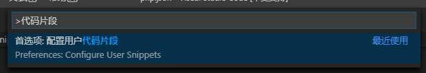

↓↓一些非线性的东西：

> 教程贴索引[电梯]-Z-BlogPHP-ZBlogger技术交流中心
> https://bbs.zblogcn.com/thread-94927.html
>
> 初学者Teaching计划-开发者中心-ZBlogger技术交流中心
> https://bbs.zblogcn.com/thread-102975.html
>
> 【开发者】大概算是进阶建议贴-开发者中心-ZBlogger技术交流中心
> https://bbs.zblogcn.com/thread-101310.html

# Z-BlogPHP插件开发教程

[TOC]

## 前言

对于已经不需要教程的我来说，并不能很客观地评断他人的教程是否对初学者有价值，自己写的这份也一样，，自己会和教会他人是两回事。。。

注：常规意义上，，汽车的生产、售卖方并不需要为你考不来驾照负责，所以 PHP 本身，以及最基本的前端知识还是需要自己具备，\[w3school 在线教程 https://www.w3school.com.cn/index.html\]

## 基于 include.php 的标准用法

可以类比一列火车。。出发时会从数据库带上固定的货物，，可以在途经的站点向指定的车箱内增加东西。。或者干脆加挂车箱。再或者把车上的东西搬下来加工一下再搬回来。

所有预定的操作都需要在出发前申请。。

```php
// 申请人“test”，具体申请事项见ActivePlugin_test函数
RegisterPlugin("test","ActivePlugin_test");

function ActivePlugin_test() {
  // 在名为Filter_Plugin_Index_Begin的站点停靠，停靠后干啥见test_hello
  Add_Filter_Plugin('Filter_Plugin_Index_Begin', 'test_hello');
}

function test_hello()
{
  // 在第一节车箱放一箱橘子【雾
  global $zbp;
  $zbp->header .= '<script>alert("hello")</script>';
}
```

预约制和买票上车制的不同是，前者到站后你要等叫号，叫到你你再上。

列车发车后，“车长”手里会有这样一份表格，而前边的 Add_Filter_Plugin()函数就相当于填写这张表；

| 站点名                    | 事项列表        |
| ------------------------- | --------------- |
| aaa                       | eeee,ttew,aewe  |
| Filter_Plugin_Index_Begin | test_hello,XXXX |
| nnn                       |                 |

```php
// 到达名为Filter_Plugin_Index_Begin的站点后，对应表格按顺序执行相应的事项
foreach ($GLOBALS['hooks']['Filter_Plugin_Index_Begin'] as $fpname => &$fpsignal) {
    $fpname();
}
```

## 插件自己新开一条铁路

插件下新建一个 api.php 文件然后写入如下示例

```php
<?php
// 引入必要的系统文件
require '../../../zb_system/function/c_system_base.php';
// 初始化
$zbp->Load();
// 判断当前所属性插件是否启用
if (!$zbp->CheckPlugin('test')) {
  $zbp->ShowError(48);
  die();
}
// 根据功能可能需要鉴权，本示例为任何人知道地址就能访问并查看本页的运行结果
// http://127.0.0.1/zb_users/plugin/test/api.php

// 取最新10篇文章
$articles = GetList(10);
$pagebar = new Pagebar($zbp->option['ZC_INDEX_REGEX'], true, true);
// 要应用主题模板必须指定pagebar标签，省略了很多属性值，所以结果会是第0页
$zbp->template->SetTags('articles', $articles);
$zbp->template->SetTags('pagebar', $pagebar);
$zbp->template->SetTemplate('index');
$zbp->template->Display();
// die();
```

## 配置项功能

很多时候，插件需要用户输入或选取一些内容并保存，然后插件运行时取用

以下是一个由用户决定读取多少篇文章的示例。

```php
// 用于获取用户输入的表单写在main.php里，请下载附件，附件代码侧重点会不一样，也更接近实用
// 保存，视情况需要对用户输入的内容进行判断和转换，比如这里实际应该确保用户提交的是正整数
if (GetVars('act', 'GET') == 'save') {
  $zbp->Config('test')->num = GetVars('num', 'POST');
  $zbp->SaveConfig('test');
}
// 使用
$num =  (int)$zbp->Config('test')->num;
$articles = GetList($num);
```

## 附件下载

目前本演示插件已经发布在Git

wdssmq/test-for-zblog: zblog插件开发演示

https://github.com/wdssmq/test-for-zblog

这里姑且推荐另一种门槛比较高的下载方式

首先请加入QQ群【我的咸鱼心】：https://jq.qq.com/?_wv=1027&k=57d1Eii

你可以在群共享中下载到 Resilio Sync 这个软件。具体怎么用你需要自行学习 →[戳这里](https://www.zhihu.com/topic/20064280/hot "Resilio Sync")

然后复制如下Key或链接进去：

**BMNFE2WCBU5Y3TMRMDU6PFEQYI6IC5IFW**

https://link.resilio.com/#f=%23%E5%90%84%E7%A7%8D%E4%BB%A3%E7%A0%81&sz=15E7&t=1&s=6VS7PMB6OSMOSWDMK6DFOQVWGYPM4XZH&i=C3F6G6ZVRZDLVWCA5DFIGFQFQSDCXPERR&v=2.6&a=2

在`【√】推荐`文件夹中你可以找到本插件的zba打包，比起git版多了一个本文档的html文件

另外`#唯有脑洞与套路`中会时不时扔一些收费插件，想白嫖的建议重点关注

## 代码编辑器

Visual Studio Code - Code Editing. Redefined
https://code.visualstudio.com/

Chinese (Simplified) Language Pack for Visual Studio Code - Visual Studio Marketplace
https://marketplace.visualstudio.com/items?itemName=MS-CEINTL.vscode-language-pack-zh-hans

### 工作区

> 本节重点不是如何创建工作区，而是建议将zb_system文件夹纳入到每个插件的工作区以方便开发

将演示插件正确放置到plugin目录后，在插件文件夹内有一个test.code-workspace文件，内容如下：

```json
{
  "folders": [
    {
      "path": "."
    },
    {
      "path": "../../../zb_system"
    }
  ],
  "settings": {}
}
```

(↓↓进阶用法中可直接生成该文件来方便开发↓↓)

开发者工具 Z-Blog 应用中心 `https://app.zblogcn.com/?id=1254`

默认vscode打开效果如图


### 推荐插件待补充

### 代码片段

↓↓【使用效果】↓↓


----

**添加代码片段到VSCode**

【查看】→【命令面板】（快捷键ctrl+shift+p）

↓↓【输入`代码片段`】↓↓



↓↓【找到`PHP`或者`html`】↓↓


【在打开的文件中编辑添加】

【也可以直接从下边项目中复制】

[https://github.com/wdssmq/snippets/tree/master/vscode/zblogcn](https://github.com/wdssmq/snippets/tree/master/vscode/zblogcn "zblog代码片段")

## 其他

### RSS

RSS - 知乎
https://www.zhihu.com/topic/19551894/top-answers

使用feeds.pub订阅我的博客
https://feeds.pub/feed/https%3A%2F%2Ffeed.wdssmq.com

Z-Blog 相关资讯 RSS 订阅-博友杂谈-ZBlogger 技术交流中心
https://bbs.zblogcn.com/thread-100631.html

### Resilio_Sync

Resilio Sync - 知乎
https://www.zhihu.com/topic/20064280/hot

### Markdown

本文档是用MD语法写就，感兴趣也可以试下，VSCode直接有相应插件，或者也可以试下[https://typora.io/](https://typora.io/ "A new way to read & write Markdown")

可以将使用typora将`docs/README.md`导出为html
