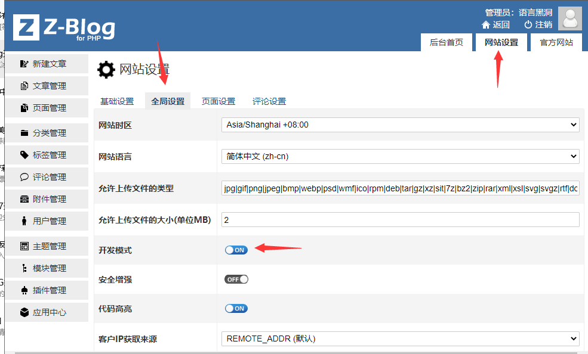
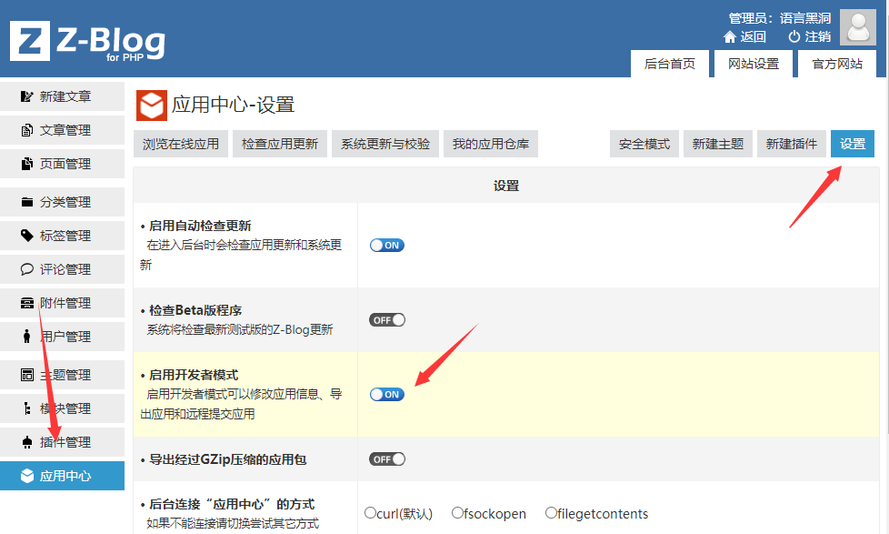
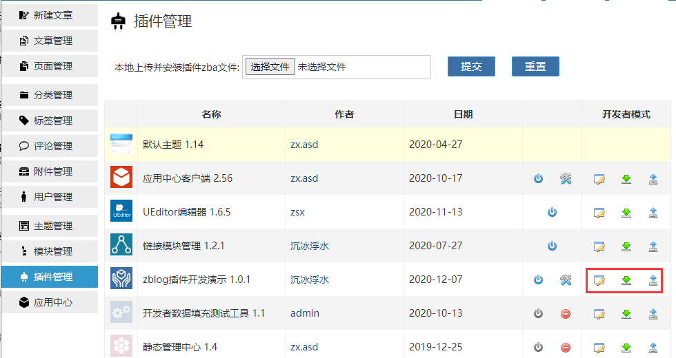
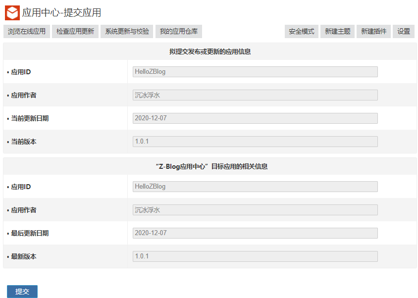
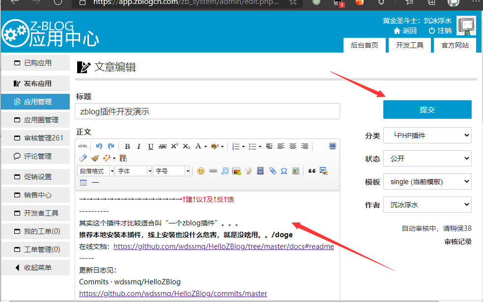
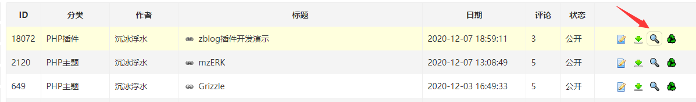

# 开发模式启用

只开应用中心的就可以上传和导出应用，，开系统调试则是为了发现应用中的错误，**有错的应用不给上架**。

[应用审核拒绝标准-精简版 [Z-Blog Wiki]](https://wiki.zblogcn.com/doku.php?id=appcenter:auditstandard_simple "应用审核拒绝标准-精简版 [Z-Blog Wiki]")

→[点击这里返回文档](/)←

→[点击这里返回文档](/)←
